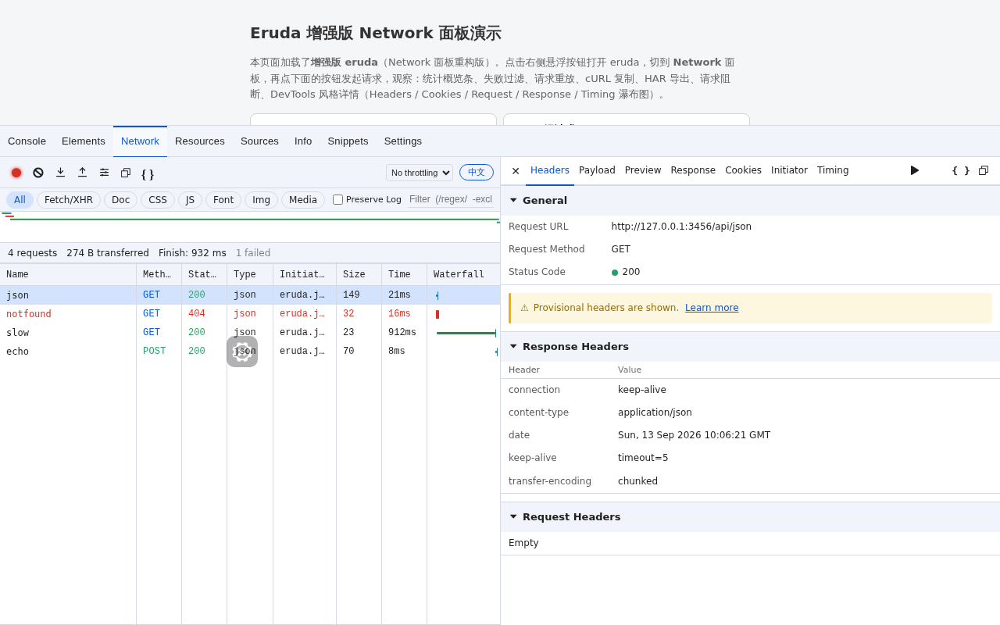
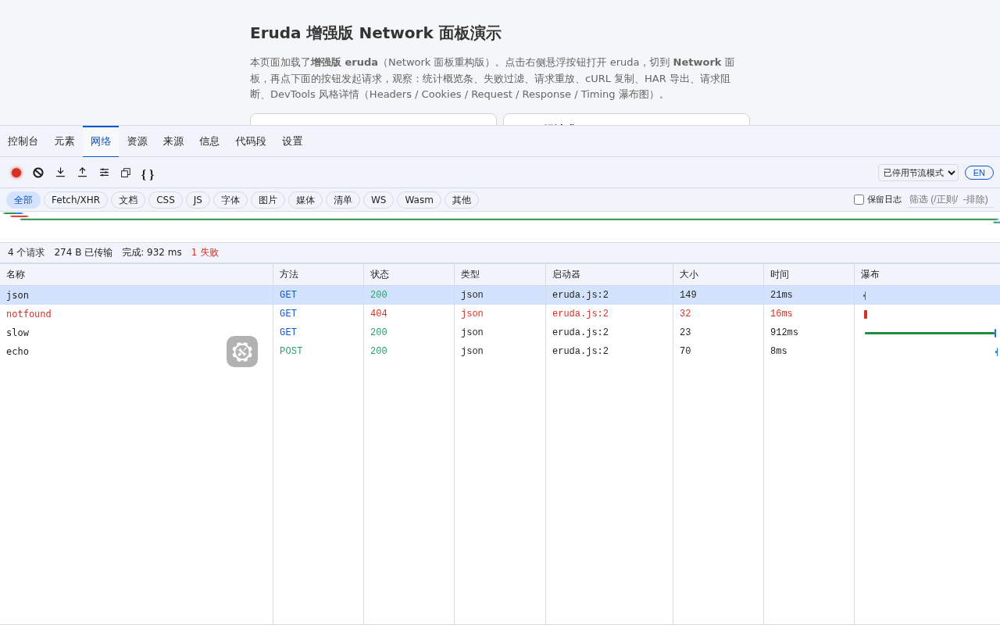
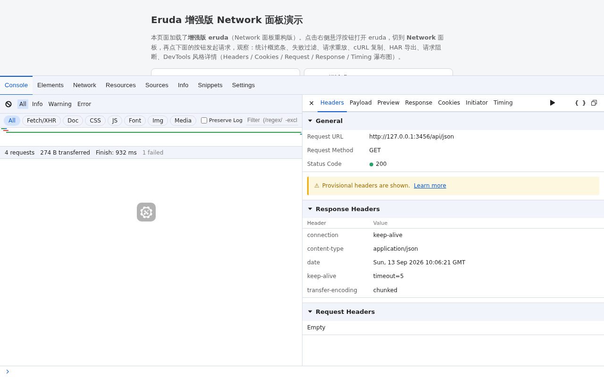
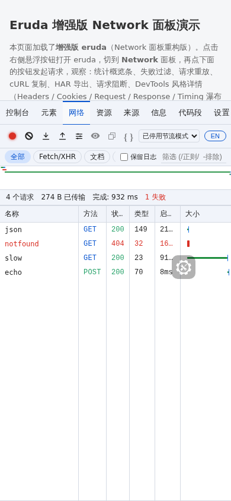
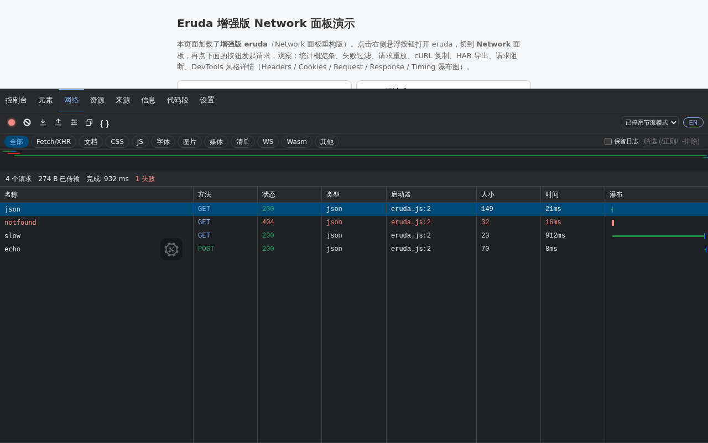
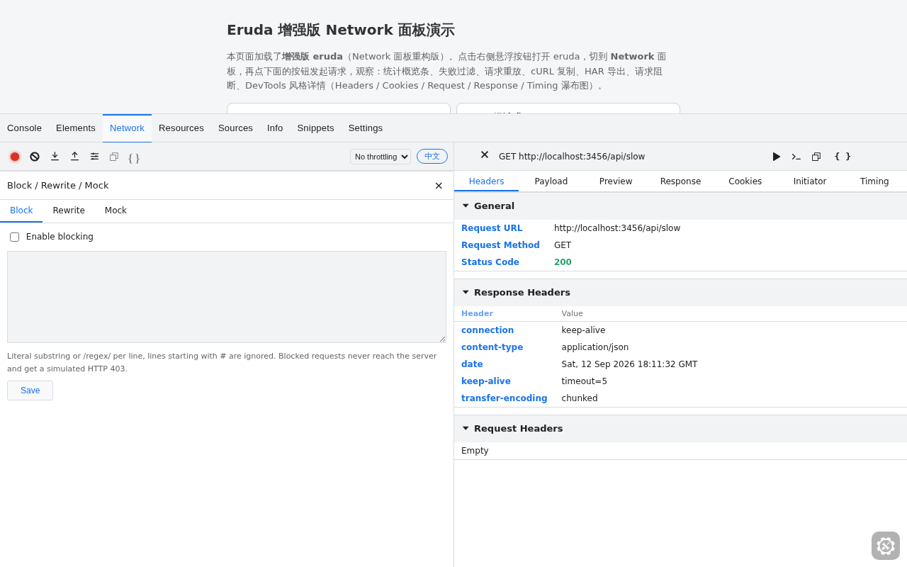
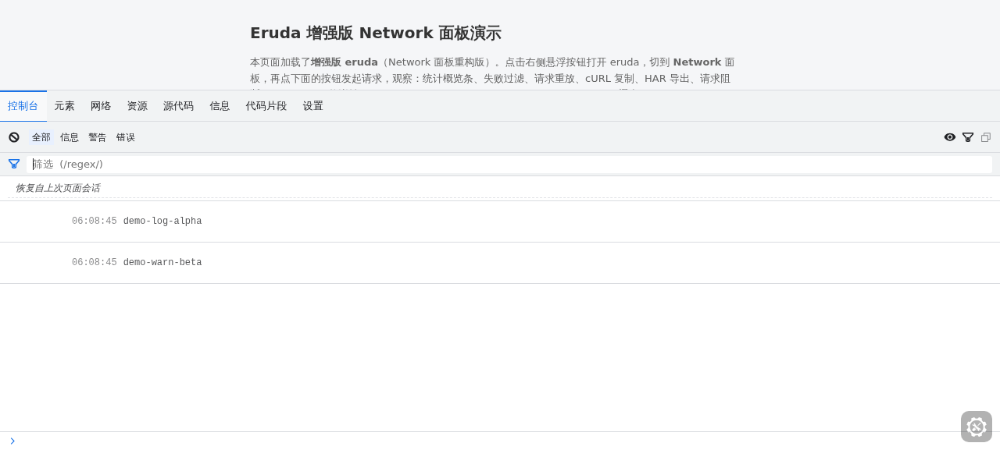
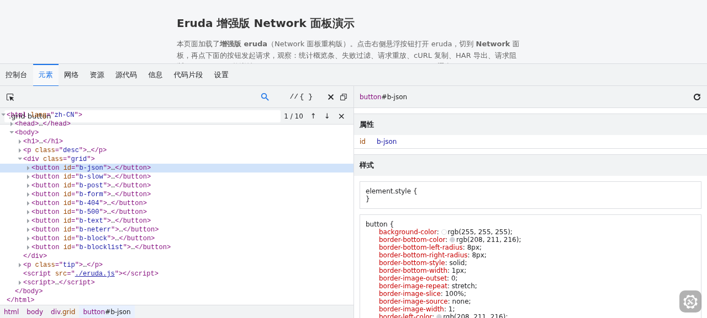

<div align="center">

# eruda-plus

**为移动端网页打造的 Chrome DevTools 级调试控制台**

在 [eruda](https://github.com/liriliri/eruda) 之上全面增强：DevTools 风格 UI、全工具中英双语、
网络请求阻断 / 重写 / Mock / 节流、HAR 导入导出、Live Expressions、DOM 搜索……

[](https://github.com/masgzy/eruda-plus/releases)
[](./LICENSE)
[](https://github.com/masgzy/eruda-plus/stargazers)
[](https://eruda.cc.cd)
[](https://github.com/liriliri/eruda)

简体中文 | [English](./README_EN.md)

**🌐 官网：<https://eruda.cc.cd>**



</div>

## ✨ 特性

### 🎨 全工具 DevTools 化

- **视觉全面对齐 Chrome DevTools**：亮 / 暗双主题设计令牌、13px 紧凑排版、等宽数据字体、扁平弹窗、细滚动条、导航选中指示条
- 覆盖 Console / Elements / Network / Resources / Sources / Info / Snippets / Settings **全部内置工具**，兼容上游 17 套第三方主题

### 🌍 全工具国际化（i18n）

- 默认跟随系统语言（`navigator.language`），支持设置中手动切换 **中文 / English**
- 切换即时生效、无需刷新，选择持久化保存

### 🛜 网络面板（对标 DevTools，借鉴 [ProxyPin](https://github.com/wanghongenpin/proxypin)）

- **九类筛选 Chip、Overview 时间轴、七列可排序表格、迷你瀑布列、状态栏、自动分屏**
- **六页签详情**：Headers / Payload / Preview（JSON 树）/ Response / Initiator（调用链）/ Timing（七段时序瀑布）
- **请求阻断**：URL 黑名单（字面量 + `/regex/`），fetch 与 XHR 双通道拦截、模拟 403
- **Rewrite 重写 / Mock 响应 / 节流**（Slow 3G / Fast 3G / Offline）
- **HAR 1.2 导入导出、Copy as fetch / cURL、正则搜索、失败请求红色高亮、Preserve Log 保留请求**

### 🧰 DevTools 功能补齐

| 工具 | 新增能力 |
| --- | --- |
| Console | Live Expressions 实时表达式、内联筛选框（正则）、Preserve Log 保留日志 |
| Elements | DOM 搜索（选择器 + 全文降级）、Copy selector / Copy XPath |
| Network | Preserve Log 保留请求（含详情与 Initiator） |

## 📦 安装

### CDN（推荐）

```html
<script src="https://cdn.jsdelivr.net/npm/eruda"></script>
<script>eruda.init();</script>
```

使用增强版（本仓库构建产物，含全部增强功能）：

```html
<script src="https://cdn.jsdelivr.net/gh/masgzy/eruda-plus@0.1.0/dist/eruda.js"></script>
<script>eruda.init();</script>
```

> 也可以锁定 `@main` 分支获取最新构建：`https://cdn.jsdelivr.net/gh/masgzy/eruda-plus@main/dist/eruda.js`

### 仅增强网络面板（独立插件）

不想替换整个 eruda？挂上独立插件即可（基于官方 eruda 运行）：

```html
<script src="https://cdn.jsdelivr.net/npm/eruda"></script>
<script src="https://cdn.jsdelivr.net/gh/masgzy/eruda-plus@0.1.0/dist/eruda-network-plus.js"></script>
<script>
  eruda.init();
  eruda.remove('network');
  eruda.add(new window.erudaNetworkPlus());
</script>
```

### npm

> npm 包将于近期发布，当前请优先使用上方 CDN 方式。

```bash
npm install eruda-plus   # 暂未发布，敬请期待
```

```js
import erudaPlus from 'eruda-plus';

erudaPlus.init();
```

### 源码补丁

直接把增强应用到任意基于 eruda v3.4.3 的源码树：

```bash
git clone https://github.com/liriliri/eruda.git eruda && cd eruda
git checkout v3.4.3
git apply /path/to/eruda-devtools-edition.patch
npx webpack --config build/webpack.prod.js
```

## 🚀 快速上手

```html
<script src="./dist/eruda.js"></script>
<script>
  eruda.init();

  // 网络：阻断 / 重写 / Mock / 节流（工具栏「规则」面板内同样可配置）
  eruda.get('network').block('/api\\/tracker/');
  eruda.get('network').rewrite('http://old.api.com', 'http://new.api.com');
  eruda.get('network').mock('/api/user', { status: 200, body: '{"mock":true}' });
  eruda.get('network').throttle('slow3g');

  // Console：实时表达式
  eruda.get('console').watch('performance.now()');

  // Elements：DOM 搜索
  eruda.get('elements').search('.item');

  // 中英切换（跟随系统默认，可手动固定）
  eruda.setConfig('settings:lang', 'zh'); // 'en' | 'zh'
</script>
```

## 🖼️ 截图

| 中文 · Network | 英文 · 桌面分屏 |
| :---: | :---: |
|  |  |

| 移动端 · 紧凑列 | 暗色主题 · Network 保留日志 |
| :---: | :---: |
|  |  |

| 规则面板（阻断/重写/Mock） | Console · Watch + 保留日志 |
| :---: | :---: |
|  |  |

| Elements · DOM 搜索 | 官网 · 内嵌在线实测 |
| :---: | :---: |
|  |  |

更多截图见 [docs/screenshots](./docs/screenshots/)。

## 🧪 本地运行演示

```bash
git clone https://github.com/masgzy/eruda-plus.git
cd eruda-plus
node demo/server.js   # 无需安装依赖
# 打开 http://localhost:3456           → 增强完整版演示
# 打开 http://localhost:3456/plugin    → 官方 eruda + 独立插件演示
```

在线体验：<https://eruda.cc.cd/demo.html>

## 📖 文档

- [图文使用教程（18 章）](./docs/TUTORIAL.md) —— 安装、各工具详解、规则语法、HAR、i18n、常见问题
- [更新日志](./CHANGELOG.md) —— 遵循 [Keep a Changelog](https://keepachangelog.com/zh-CN/1.1.0/) 规范
- 版本号遵循[语义化版本 2.0.0](https://semver.org/lang/zh-CN/)

## 🗺️ 路线图

- [ ] 发布到 npm registry（当前可通过 GitHub + jsdelivr 使用）
- [ ] WebSocket / SSE 请求捕获增强
- [ ] 更多语言包（日本語 / Español …）
- [ ] 请求对比 Diff 视图
- [ ] 规则云端同步与导入导出

欢迎通过 Issue / PR 提出建议！

## 🤝 贡献

欢迎一切形式的贡献：

1. Fork 本仓库并创建特性分支（`git checkout -b feat/amazing-feature`）
2. 提交变更（请遵循 [Conventional Commits](https://www.conventionalcommits.org/zh-hans/) 规范，如 `feat: ...`、`fix: ...`）
3. 推送分支并发起 Pull Request

开发调试：

```bash
npm install
npx webpack --config build/webpack.dev.js   # 开发服务器
npx eslint .                                # 代码检查
```

## 🙏 致谢

- [eruda](https://github.com/liriliri/eruda) —— 本项目基于其 v3.4.3 源码增强，感谢 [@liriliri](https://github.com/liriliri) 的杰出工作
- [ProxyPin](https://github.com/wanghongenpin/proxypin) —— 阻断 / 重写 / Mock 功能的设计灵感来源
- [Chrome DevTools (devtools-frontend)](https://github.com/ChromeDevTools/devtools-frontend) —— UI / UX 设计参照
- [licia](https://github.com/liriliri/licia) / [luna](https://github.com/liriliri/luna) 组件族 / [chobitsu](https://github.com/liriliri/chobitsu)

> ⚠️ 本项目与 Google Chrome / Chrome DevTools 官方无任何隶属关系，"DevTools" 仅用于描述 UI 风格与功能对齐目标。

## 📄 许可证

[MIT](./LICENSE) © liriliri（原版 eruda）& masgzy 及 eruda-plus 贡献者（增强部分）
